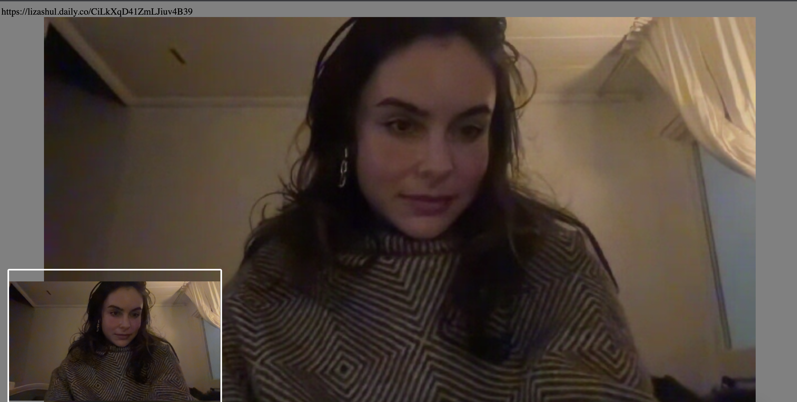

# Daily OpenTok Shim conversion demo

This demo showcases how developers can use Daily's OpenTok client and server-side shims to start porting their existing OpenTok application to Daily. 

The client-side version of this demo is loosely based on Vonage's [Basic web client walkthrough](https://tokbox.com/developer/tutorials/web/basic-video-chat/), in which the user builds a [Basic Video Chat demo](https://github.com/opentok/opentok-web-samples/tree/main/Basic%20Video%20Chat). It uses [daily-opentok-client](https://www.npmjs.com/package/daily-opentok-client) to replace the OpenTok implementation with Daily without changing any other client code.

The demo also uses our [daily-opentok-node](https://www.npmjs.com/package/daily-opentok-node) shim to create sessions (known as "rooms" in Daily) and access tokens to be used by the client. This contains minimal code changes to account for which API credentials to pass into the `OpenTok` constructor: Daily's or Vonage's.



## Running locally

After cloning the repository, copy `.env.sample` into `.env` and fill in the environment variables there. Then, run the following:

```
npm i
npm run dev
```

Your browser should automatically open to the demo home page on `localhost`. If it doesn't, navigate manually to the port shown in your terminal. The string which is displayed at the top of the page is your OpenTok session ID _or_ your Daily room URL (if you toggled to Daily). 

Navigating to the path without any query parameters will create a new session. To join an existing session, go to `localhost:8888/?sessionID=YOUR_SESSION_ID`, replacing `YOUR_SESSION_ID` with either the OpenTok session ID or the Daily room URL displayed at the top of the call page.